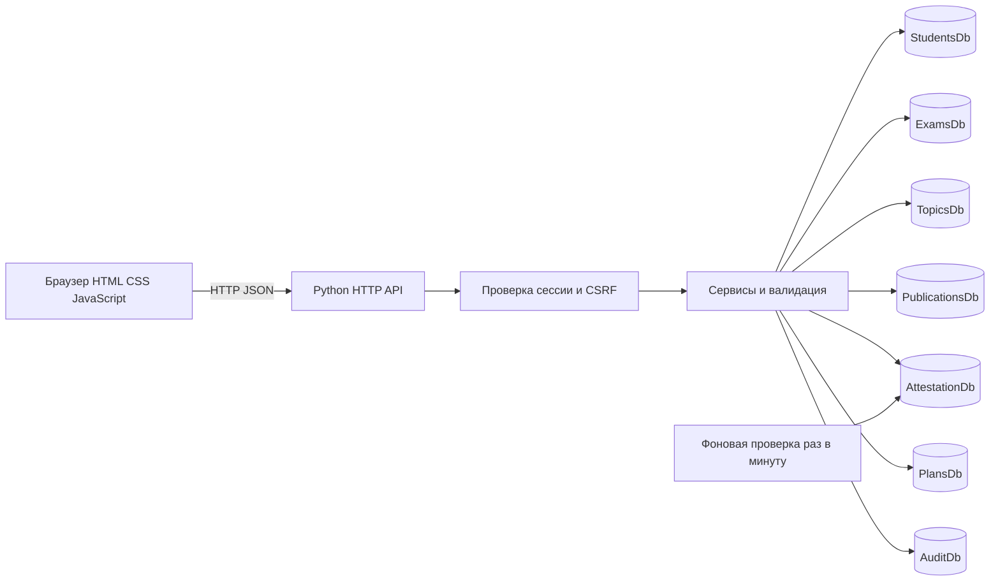
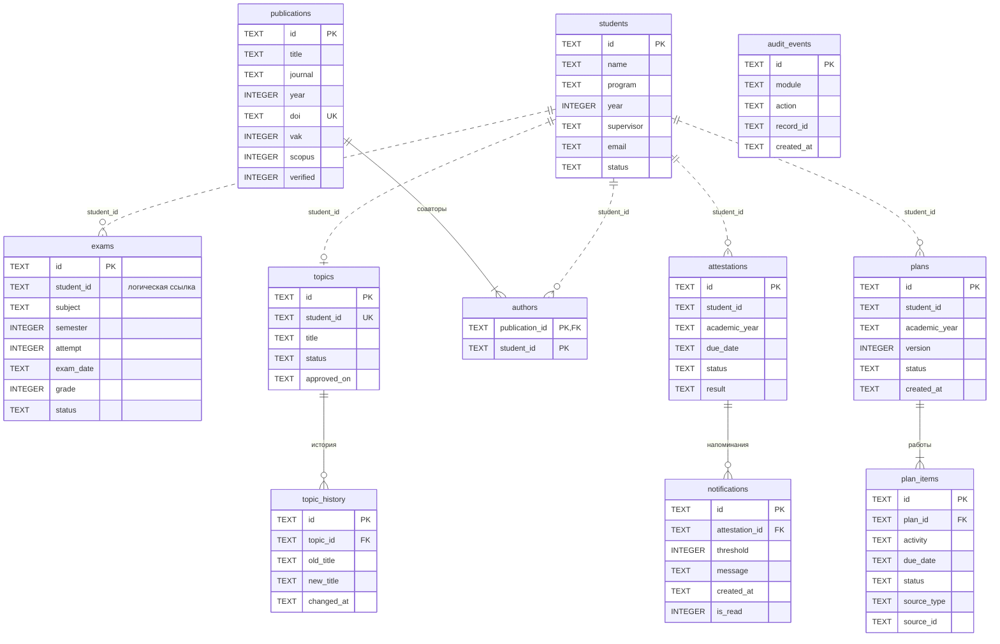

# Архитектура проекта

## Общая схема

HTML, CSS и JavaScript находятся в `static/`. Сервер и доменные функции — в `app.py`. SQLite-файлы создаются автоматически при запуске. Для учебной простоты сервер, маршруты и сервисы собраны в одном модуле, а их функции разделены логически.

## Схема данных

Пунктирные межбазовые связи реализованы проверками сервиса, а не SQLite FOREIGN KEY. Внутри одной базы FK включены через PRAGMA foreign_keys=ON; дочерние строки удаляются каскадно. План хранит копии описаний работ, поэтому удаление источника не удаляет работы из сохранённого плана.

UNIQUE ограничения: тема на магистранта; DOI, когда он заполнен; экзамен по магистранту + дисциплине + семестру + попытке; аттестация по магистранту + учебному году; версия плана по магистранту + году + версии; уведомление по аттестации + порогу; авторство по статье + магистранту.

Прикладная блокировка RLock согласует запись и межбазовые проверки в одном процессе. Это не распределённая транзакция: не запускайте два процесса приложения на одном каталоге данных и не редактируйте SQLite-файлы сторонними программами во время работы сервера.

## Основные функции

| Функция | Ответственность |
|---|---|
| init_db | Создание 7 баз, таблиц, внешних ключей и индексов |
| validate / save | Валидация и добавление или изменение записи |
| delete | Удаление с проверкой межбазовых связей |
| reminders | Расчёт ближайшего порога и сохранение уведомления |
| create_plan | Сбор работ из модулей в новую версию плана |
| update_plan | Изменение работ и контролируемый переход статуса |
| export_docx | Создание ZIP/OOXML документа Word |
| snapshot | Согласованный снимок данных для интерфейса |
| audit | Журналирование операций без содержимого персональных данных |
| Handler | HTTP-маршрутизация, сессии, CSRF, ответы об ошибках |

## API

Все маршруты, кроме входа и статических файлов, требуют cookie-сессию. Для запросов изменения нужен заголовок `X-CSRF-Token`, возвращаемый в `/api/state`.

| Метод и путь | Действие |
|---|---|
| POST /api/login | Вход с полем password |
| POST /api/logout | Завершение текущей сессии |
| GET /api/state | Данные разделов, уведомления, журнал и сведения о БД |
| POST /api/students и аналогичные пути модулей | Добавление |
| PUT /api/{module}/{id} | Изменение |
| DELETE /api/{module}/{id} | Удаление |
| POST /api/plans | Формирование версии по student_id и academic_year |
| PUT /api/plans/{id} | Изменение статуса и работ |
| GET /api/export/{plan_id} | Скачать Word |
| POST /api/demo | Вымышленные данные для пустой системы |
| POST /api/read-notifications | Пометить уведомления прочитанными |

Модули: students, exams, topics, publications, attestations, plans. Успешное добавление возвращает 201, изменение 200; ошибки данных 400, отсутствие входа 401, нарушение CSRF 403. Доступ к серверу ограничен loopback-адресом и проверкой Host. Это учебный HTTP-сервер для локального использования, не промышленная платформа.

## Напоминания

1. Выбрать аттестации со статусом «Запланирована».
2. Рассчитать число дней до срока по локальной дате компьютера.
3. Выбрать актуальный порог: 30, 7, 1 день или просрочка.
4. INSERT OR IGNORE по уникальной паре аттестация + порог.
5. Показать непрочитанные уведомления на главной странице.

При переносе срока уведомления этой аттестации пересоздаются. При завершении аттестации её уведомления удаляются. Пороговое уведомление создаётся один раз; его текст отражает состояние на момент создания, а текущая дата и срок видны в списке аттестаций.

## План

Шаблон учебного года: 1 сентября — 31 августа. Включаются обзор литературы, исследование, экзамены с датой в этом периоде, задача подготовки статьи, зарегистрированные публикации по годам и аттестация выбранного учебного года. Для формирования обязательна тема диссертации. Пользователь проверяет и редактирует черновик перед согласованием.

Статусы: Черновик → На согласовании → Утверждён → Завершён. С согласования можно вернуть черновик. Утверждённое содержание неизменно; для исправления формируется новая версия. Экспорт DOCX использует сохранённые работы, но ФИО и руководителя читает из текущего профиля.

## Дополнения версии 2

`documents.py` отвечает за реквизиты, реестр снимков и рендер HTML / OOXML. `assistant_service.py` отвечает за контекст, локальную сводку, вызов Responses API и подтверждаемые предложения. Браузерный интерфейс этих разделов расположен в `static/enhancements.js`; стили — в `static/enhancements.css`. Печатный шаблон использует `document.css` и `document.js`.

Новые таблицы в AuditDb:

| Таблица | Назначение |
|---|---|
| organization_settings | Одна запись с редактируемыми реквизитами в JSON |
| documents | Вид, язык, номер и неизменяемый JSON-снимок документа |
| assistant_proposals | Идентификатор предложения, хеш сессии, срок действия, входные данные и результат |

Новые API:

| Метод | Маршрут | Назначение |
|---|---|---|
| PUT | /api/settings | Сохранить реквизиты |
| POST | /api/documents | Создать проект документа в реестре |
| GET | /api/documents/{id} | Просмотр и печать |
| GET | /api/documents/{id}.docx | Экспорт сохранённого снимка в Word |
| POST | /api/assistant | Ответ по контексту и необязательное предложение |
| POST | /api/assistant/approve/{id} | Подтвердить создание новой версии плана |

Все маршруты требуют входа; запросы изменения требуют CSRF-токен. Данные модели никогда не исполняются как код, SQL или HTML. Разрешённое действие одно: сформировать план для магистранта, выбранного пользователем. Для него сервер повторно проверяет наличие темы и валидность учебного года. Предложение связано с сессией, действует 15 минут и после успешного выполнения хранит результат.

Сводка облачного помощника исключает прямые идентификаторы и текст персональных записей. Свободный вопрос не подвергается надёжной автоматической анонимизации: пользователь должен проверить его перед отправкой. Чат хранится только в памяти вкладки; записи запросов не сохраняются в аудит, но факт обращения фиксируется. Облачная модель не выполняет запись в базу.

Документ в реестре сохраняет реквизиты и ФИО на дату подготовки. Старый `/api/export/{plan_id}` оставлен для обратной совместимости; новый интерфейс ведёт в реестр документов. Маркировка «Проект документа» не снимается автоматически. Пользовательское содержание не переводится языковой моделью при экспорте.

Приложение использует независимые SQLite-файлы и блокировку в одном процессе. Идентификатор плана для предложения помощника детерминирован: повторный вызов после сбоя между созданием плана и сохранением результата возвращает ту же версию, а не создаёт дубликат. После перезапуска сессия входа прекращается, старое предложение недоступно из нового входа. Распределённая транзакция между базами не реализована.
